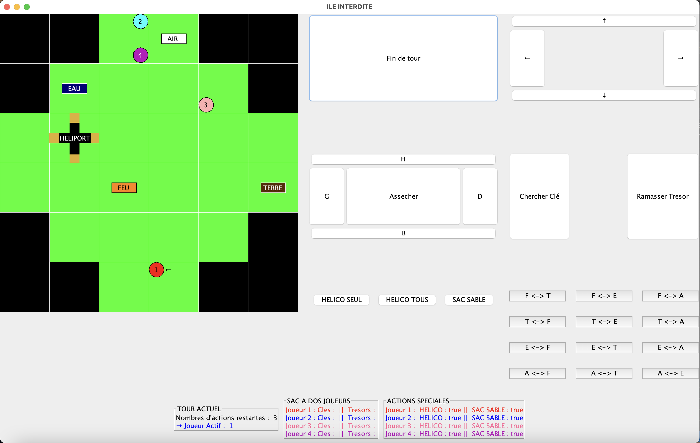

# Ile Interdite

			Projet Île Interdite
				
				Thomas Sinapi et Stevan Bakic

Tout d’abord, nous tenons à remercier M.Roman Le Montagner, notre professeur de travaux dirigés, qui nous a suivi et formé durant tout ce semestre.

Les parties du sujet traités:

Nous avions pour but de réaliser une version informatique du jeu l’île interdite et d’implementer les différentes fonctionnalités de base (comme déplacer les joueurs, assécher la case courante et les cases adjacentes, chercher et récupérer les clés,  récupérer les artefacts etc) et les fonctionnalités un peu plus avancés (comme) de ce jeu.

Nous avons donc traité l’entièreté des parties 10.1, 10.2 et 10.3 ainsi que la partie 10.4 où nous avons réalisé deux extensions : Échanges de clés et Actions spéciales.

Répartition du travail:
Nous avons effectuer l'entièreté du travail à deux. Thomas s'est plus occupé de la vue et Stevan du modèle mais chaque conception du projet ont été prise à deux.

Nos choix d’architecture:
Pour réaliser ce projet, nous nous sommes organisés selon l’architecture Modèle-Vue-Contrôleur que nous avions vu en classe.
Nous avons dans notre Modele des classes comme Cle.java, Ile.java, Joueur.java, Modele.java, Tresor.java et Zone.java qui sont les bases de notre applications. 
Nous avons dans notre Vue, nous avons des classes telles que Vue.java, VueCommandes.java, VueGrille.java, VueJoueur.java ainsi que les interfaces Observable.java et Observer.java, ce qui est une base de l’affichage graphique de notre application.
Pour finir, dans notre Controleur nous avons un grand nombre de fichier Control tels que ControlAsseche.java, ControlFinTour ou encore ControlEvA qui nous ont permis de faire le lien (à l’aide des boutons notamment) entre l’utilisateur et l’application.

Difficultés rencontrées:

Nous avons eu beaucoup de difficultés à démarrer le projet notamment pour afficher l'ile car nous n'utilisions pas la structure de Conway avec Observable et Observer mais nous avons décider au final de prendre cette structure.

Nous avons fais l'entièreté du projet de nous même en utilisant les TPs vu en cours et les outils java.

